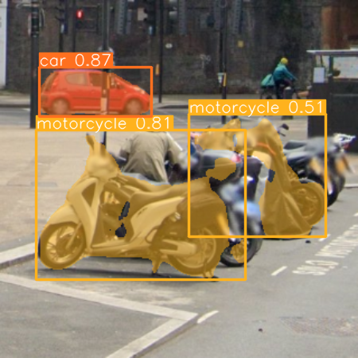

# find the original code at: 
https://github.com/aplesner/Breaking-reCAPTCHAv2/tree/main

# All credit goes to the original authors.

# Breaking reCAPTCHAv2
Code for the paper `Breaking reCAPTCHAv2` accepted at COMPSAC 2024 (https://arxiv.org/abs/2409.08831).


| CAPTCHA Example | CAPTCHA Result |
|:---:|:---:|
|  |  |

## Requirements
- Python 3.9
- Firefox (Geckodriver)
- Required libraries (see `requirements.txt`)

## Installation
1. Clone the repository

2. Install the required libraries:
   ```
   pip install -r requirements.txt
   ```

3. Download and set up Geckodriver:
   - Download Geckodriver from the official website: [Geckodriver Releases](https://github.com/mozilla/geckodriver/releases)
   - Extract the downloaded archive and add the path to the `geckodriver` executable to your system's PATH environment variable.

## Usage
- Run `solve_recaptcha.py` to solve a single reCAPTCHA challenge:
  ```
  python solve_recaptcha.py
  ```

- Run `test_environment.py` to solve multiple reCAPTCHA challenges and create a log file:
  ```
  python test_environment.py
  ```

## Data
- The training data for the classification task can be found [here](https://drive.google.com/drive/folders/19kET6PFXHaHZqzr9DU_ZsgX-n13Ef4sj?usp=sharing).
- The validation data for the classification task can be found [here](https://drive.google.com/drive/folders/19kG2NQls2iH1sUq0js0MOArBiJiOmVGM?usp=sharing).

## Project Structure
This project has the following directory structure:

- `assets/`: Contains the images used in the README.
- `IP/`: Contains the script for changing IP address.
  - `vpn.py`: Script for changing IP address (only works on macOS).
- `models/`: Contains all the models used in the project.
  - `YOLO_Classification/`: Contains the YOLO model for classification.
  - `YOLO_Segment/`: Contains the YOLO model for segmentation.
- `utils/`: Contains utility scripts.
  - `collect_data.py`: Script for collecting data for the classification model.
  - `label_tool.py`: A UI tool for labeling CAPTCHA images.
  - `visualize_log_files.py`: Analyzes log files, providing insights into task attempts, their distribution, and key statistical measures.
- `README.md`: This file, providing an overview of the project.
- `solve_recaptcha.py`: Demo script for solving a single reCAPTCHA challenge using Selenium.
- `test_environment.py`: Demo script for solving multiple reCAPTCHA challenges using Selenium and creating a log file.
- `requirements.txt`: Contains the required libraries for the project.

## System Compatibility
Please note that the code in this project was developed and tested on macOS M1. While most of the code should be compatible with other operating systems, certain functionalities, such as the VPN script (`vpn.py`), may not work on non-macOS systems. If you encounter any issues running the code on a different operating system, please refer to the documentation of the specific libraries or tools used in the project for guidance on how to set them up for your system.

